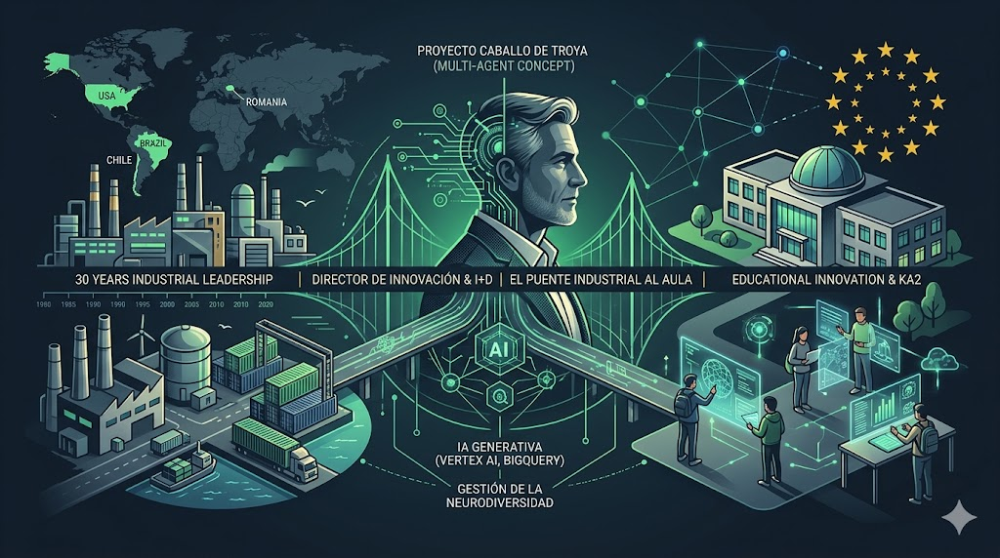

  

# Sergio Bernárdez Gato | Estrategia, Innovación e Ingeniería STEM

### 🏭 Perfil Ejecutivo e Industrial Internacional

28 años de trayectoria liderando operaciones complejas y tecnología en entornos multinacionales:

* **Director Industrial de Multinacional:** Gestión de plantas y activos en **EE.UU. (Pennsylvania), Brasil, Chile y Rumanía**.

* **Director de Innovación de Multinacional:** Liderazgo de procesos de transformación tecnológica y eficiencia operativa.

### 🤖 Proyectos de I+D y Arquitectura IA

Especialista en el despliegue de soluciones de Inteligencia Artificial orientadas a resultados:

* **Proyecto Titan & Sabina:** SaaS especializado para Toma de Decisiones autopoiética y metacognitiva (IA). Arquitectura de software orientada a la optimización de procesos críticos.

* **Proyecto "Caballo de Troya":** Ecosistema de IA (Vertex AI + BigQuery) para la gestión de la neurodiversidad y el éxito escolar mediante telemetría objetiva en tiempo real.

## 🇪🇺 Alianza Estratégica: Liderazgo de Consorcios KA2

Busco instituciones educativas de alto nivel para co-liderar proyectos **Erasmus+ (KA2)**:

1. **Dirección de I+D:** Gestión integral de la arquitectura técnica y administrativa del consorcio para la captación de fondos europeos.

2. **Docencia Estratégica:** Capacidad de asunción de carga lectiva en todo el espectro STEM: Matemáticas, Física, Química, Dibujo Técnico y Tecnología. Mi enfoque no es el temario estanco, sino la integración transversal de estas disciplinas bajo la dirección del proyecto de IA y los fondos europeos

### 🎓 Especialización Docente: El Puente STEM

Mi integración en el aula se centra en la profesionalización de las materias científicas, aportando el contexto real de la ingeniería y la industria:

* **Matemáticas e IA:** De la abstracción al algoritmo. Aplicación de cálculo y estadística en modelos de Inteligencia Artificial (Gemini/Vertex AI).

* **Física y Química Aplicada:** Fundamentos químicos y procesos físicos aplicados a la producción industrial y nuevos materiales.

* **Tecnología y Dibujo Técnico:** Diseño de soluciones, visión espacial y arquitectura de sistemas basada en 30 años de experiencia técnica.

## 🎓 Formación Superior y Capacidad Investigadora

Mi perfil combina la máxima titulación técnica con la habilitación pedagógica y la formación continua en ciencias puras:

* **Doctorado (DEA):** Diploma de Estudios Avanzados finalizado. Capacidad probada para el liderazgo de proyectos de investigación y rigor metodológico.

* **Doble Ingeniería:** Ingeniero Superior de Montes e Ingeniero Forestal. Experto en gestión de recursos, procesos industriales y sistemas complejos.

* **Especialización en Ciencias:** Máster en Química Orgánica (en curso) y Técnico Medioambiental.

* **Habilitación Docente:** Máster de Profesorado (MAES) con especialidad en STEM.

## 📂 Acceso a Expediente y Recursos Técnicos

* 📄 **[Dossier Ejecutivo: Sergio Bernárdez Gato](./dossier-ejecutivo/README.md)** *Propuesta de valor: Ingeniería, IA y estrategia de captación de recursos para el centro.*
  
* 🌍 **[Trayectoria Industrial y Estratégica](./trayectoria/README.md)** *30 años liderando operaciones, innovación (H2020) y gestión de crisis en EE.UU., Brasil, Chile y Rumanía.*

* 🍎 **[Manifiesto: Liderazgo y Realidad del Aula](./manifiesto/README.md)** *Por qué la docencia no es transmitir datos, sino gestionar el potencial humano mediante liderazgo industrial.*

* ☁️ **[Ingeniería en IA y MLOps](./cloud-computing/README.md)** *Dossier de dominio académico: Desde el álgebra profunda y tensores, hasta arquitecturas Multiagente en Google Cloud.*

* 🐎 **[Proyecto "Caballo de Troya"](./caballo-de-troya/README.md)** *Ecosistema EdTech (Vertex AI): Telemetría pedagógica, alineamiento LOMLOE y eliminación del Efecto Pigmalión.*

* 🤖 **[Titán y Sabina: SaaS Industrial](./titan-sabina/README.md)** *Arquitectura autopoyética y auditoría determinista. Trazabilidad legal inmutable mediante Blockchain (Polygon).*

* 📜 **[Credenciales Académicas y Docentes](./credenciales/README.md)** *Doble Ingeniería, DEA (Doctorado), Máster en Formación del Profesorado y Máster en Química Orgánica.*

* 📐 **[Cuadernillos: Álgebra Aplicada a la IA](https://github.com/bernardezgatosergio-ai/bernardezgatosergio-ai/tree/main/cuadernillos-algebra-ia)**
  *Material didáctico propio. Dos cuadernillos que llevan al estudiante desde los axiomas del espacio vectorial hasta las arquitecturas Transformer, con rigor matemático y ejemplos aplicados a redes neuronales.*
---
## 📬 Contacto Directo
**Teléfono:** 604 023 231 | **Email:** [bernardezgatosergio@gmail.com](mailto:bernardezgatosergio@gmail.com)

---

  Ingeniería aplicada a la educación | 2026

  

